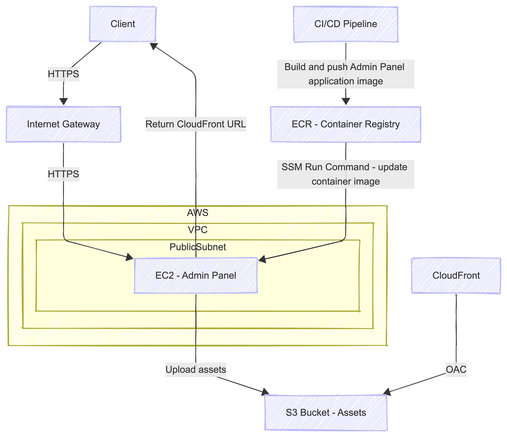

# Scalable Static Assets Infrastructure

Este projeto implementa uma infraestrutura escalável, segura e moderna na AWS para armazenamento e distribuição de ativos estáticos, permitindo upload via um painel administrativo provisionado automaticamente.

## 🏗 Arquitetura

A arquitetura foi desenhada para garantir que o conteúdo estático (armazenado no S3) seja entregue (via CloudFront) de forma segura, enquanto o gerenciamento desses ativos é feito através de um painel administrativo rodando em EC2.



### Componentes

- **S3 (Simple Storage Service):** Armazenamento durável e escalável para os arquivos estáticos. Configurado com versionamento para proteção contra deleções acidentais.
- **CloudFront:** CDN (Rede de Entrega de Conteúdo) para cachear e servir os arquivos próximos ao usuário final, reduzindo latência e custos de transferência do S3.
- **EC2 (Admin Panel):** Instância Linux rodando uma aplicação Flask (via Docker) que serve como interface para upload de arquivos para o bucket S3.
- **VPC (Virtual Private Cloud):** Rede isolada criada do zero para hospedar a instância EC2, garantindo controle total sobre o tráfego de rede.

---

## 🧐 Decisões Técnicas

Cada componente foi escolhido com base em critérios de segurança, manutenibilidade e escalabilidade.

### 1. CloudFront Origin Access Control (OAC)

Optei por utilizar **OAC (Origin Access Control)** em vez do antigo OAI.

O OAC é a recomendação atual da AWS, oferecendo uma postura de segurança melhor e fechando o acesso direto ao S3 de forma mais robusta através de policies no bucket, garantindo que todo tráfego público passe obrigatoriamente pelo CloudFront.

### 2. Módulos Próprios vs Módulos Oficiais da AWS

Decidi modularizar a infraestrutura (`infra/modules/`) criando módulos próprios em vez de usar os módulos genéricos da comunidade (`terraform-aws-modules`).

Módulos da comunidade costumam ser excelentes, mas sofrem de "bloat" (excesso de complexidade e variáveis) para cobrir todos os casos de uso possíveis. Para este desafio, módulos customizados permitiram:
  - **Simplicidade e Leitura:** Apenas os recursos necessários foram declarados.
  - **Controle Granular:** A política do S3 para permitir o OAC, por exemplo, pôde ser injetada de forma precisa sem depender de complexidades de módulos externos.
  - **Evolução Independente:** Facilita alterações específicas na arquitetura sem medo de atualizações upstream.

### 3. Configuração da VPC e Instância Pública

A instância foi provisionada em uma **Subnet Pública** com IP público.

Para simplificar o acesso ao Painel Admin neste escopo de desafio, permitindo que o avaliador acesse via navegador.

### 4. User Data e Automação Docker

Utilizei um script de `user_data` que roda na inicialização da instância.

Isso segue o princípio de "Imutable Infrastructure" (ou próximo disso). A instância não precisa de configuração manual pós-deploy. O script automaticamente:
  - Atualiza dependências.
  - Faz login no ECR (Elastic Container Registry).
  - Baixa a imagem Docker mais recente do painel admin.
  - Sobe o container.
Isso garante recuperação rápida; se a instância morrer, o Auto Scaling poderia subir outra idêntica em minutos.

### 5. Logs da Instância

Os logs do script de inicialização (`user-data`) estão configurados para serem persistidos em `/var/log/user-data.log`.

Essencial para debug. Como a automação roda "às escuras" durante o boot, ter um log detalhado permite diagnosticar falhas no pull da imagem Docker ou permissões de IAM sem precisar "adivinhar" o erro.

---

## 🚀 Como Executar

### Pré-requisitos

- [Terraform](https://www.terraform.io/) instalado.
- [AWS CLI](https://aws.amazon.com/cli/) instalado e configurado com suas credenciais.
- [Docker](https://www.docker.com/) (opcional, caso queira buildar a imagem do admin localmente).

### Passo a Passo

1.  **Clone o repositório:**

    ```bash
    git clone https://github.com/iriscafe/Scalable-Static-Assets-Infrastructure
    cd Scalable-Static-Assets-Infrastructure/infra
    ``

2.  **Inicialize e Aplique o Terraform:**
    Se você tiver o `make` instalado, pode usar os atalhos. Caso contrário, use os comandos do terraform diretamente.

    ```bash
    # Inicializa providers e backend
    make init
    # ou: terraform init

    # Visualiza o plano de execução
    make plan
    # ou: terraform plan -var-file="dev/ec2.tfvars" ... (veja o Makefile (make help) para os argumentos exatos)

    # Aplica a infraestrutura
    make apply
    ```

    ⚠️ **Nota:** Durante o `apply`, o Terraform verificará se a imagem Docker está no ECR e tentará subir a EC2. O ideal é garantir a imagem no ECR exista antes, no meu caso eu já tinha a imagem no ECR por conta da pipeline implementada aqui no repositório.

3.  **Acessando o Painel:**
    - Pegue o IP público da instância no output do Terraform.
    - Acesse no navegador: `http://<IP_PUBLICO>`

---

## 💡 Sugestões de Melhoria (Roadmap)

1.  **HTTPS e Domínio Personalizado:**
    - Integrar AWS ACM (Certificate Manager) e Route53 para servir o painel admin via HTTPS em vez de IP bruto sem criptografia em trânsito.
2.  **Segurança de Rede (WAF & Privada):**
    - Adicionar AWS WAF (Web Application Firewall) no CloudFront.
    - Mover a EC2 para uma Subnet Privada atrás de um Application Load Balancer (ALB) ou usar Session Manager para acesso, removendo a necessidade de porta 22 aberta para a internet.
3.  **CI/CD Automatizado:**
    - Implementar Pipeline no GitHub Actions que roda `terraform apply` automaticamente em Pull Requests aprovados e faz o build/push da imagem Docker. (VOU FAZER)
4.  **Monitoramento:**
    - Criar Dashboards no CloudWatch monitorando CPU da instância e métricas de distribuição do CloudFront (Cache Hit Rate).
